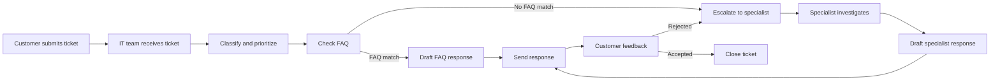

```{python}
#| tags: [parameters]
title = "AI Ticket Workflow Demo"
subtitle = "From customer ticket to response, with visible skills and controls"
audience = "MBA / MSBA classroom overview"
repo = "customer-ticket-process"
```

## `{python} title` {.title-slide}

`{python} subtitle`

`{python} audience`

::: notes
This deck is designed for students with limited technical background. The goal
is not to teach Python. The goal is to explain what the repo demonstrates and
how to inspect the workflow with enough confidence to ask good questions.
:::

## The Big Idea {.content-slide}

This repo demonstrates how a customer-support process can be turned into an
AI-assisted workflow.

Instead of one large AI prompt trying to do everything, the workflow is split
into smaller **skills**:

- receive the ticket
- classify and prioritize it
- check the FAQ knowledge base
- draft a response
- escalate to a specialist when needed
- verify whether the customer is satisfied

::: notes
The key message for MBA students: this is process design plus AI governance,
not just code. The repo makes the workflow visible, auditable, and testable.
:::

## What You Can Do in the Demo {.content-slide}

Run the local web app:

```bash
uv run python scripts/ticket_web_demo.py --host 127.0.0.1 --port 8767
```

Then open:

```text
http://127.0.0.1:8767
```

In the browser, you can:

- choose an example ticket
- step through the workflow one skill at a time
- see what each skill read and wrote
- compare the FAQ branch and specialist branch
- review the final customer response

::: notes
The web demo is the main student experience. The code exists so that the demo is
repeatable and transparent, but students do not need to edit code to understand
the process.
:::

## Business Process View {.content-slide}



::: notes
This is the business workflow. The repo turns this diagram into a working
prototype that students can step through.
:::

## The Roles {.content-slide}

:::::: columns
::: {.column width="33%"}
**Customer**

Submits the problem and later accepts or rejects the response.
:::

::: {.column width="33%"}
**IT Team**

Owns intake, triage, FAQ use, response drafting, and customer communication.
:::

::: {.column width="34%"}
**IT Specialist**

Handles cases where the FAQ knowledge base is not enough.
:::
::::::

The AI workflow supports these roles; it does not erase them.

::: notes
This is important for MBA discussion: the workflow preserves role boundaries.
The system helps route and draft, but some steps still require human judgment.
:::

## What Is a Skill? {.content-slide}

A skill is a focused unit of work.

Each skill has:

- instructions for an AI agent: `skills/<skill>/SKILL.md`
- executable logic for the demo: `skills/<skill>/scripts/*.py`
- data outputs saved to working CSV files

Example:

```text
skills/check-faq-resolution/
  SKILL.md
  scripts/check_faq_resolution.py
```

::: notes
For nontechnical students: think of a skill as a mini-standard operating
procedure. The script is the repeatable version used by the demo.
:::

## Why So Many Small Skills? {.content-slide}

Small skills make the workflow easier to manage.

- easier to explain
- easier to test
- easier to replace
- easier to audit
- easier to assign to a human owner
- easier to see where the workflow failed

One giant AI answer would be harder to inspect.

::: notes
This is a management design point. Modularity helps governance, debugging, and
continuous improvement.
:::

## What Is the Orchestrator? {.content-slide}

The orchestrator is the workflow manager.

It answers:

- Which skill should run next?
- What ticket are we working on?
- Where should each skill read and write data?
- When should the workflow pause for human input?

In this repo, the orchestrator lives in:

```text
scripts/ticket_web_demo.py
```

Search for:

```text
TicketWorkflowOrchestrator
```

::: notes
Students do not need to read all of this file. They should know this is where
the workflow engine lives.
:::

## Why Is the Orchestrator Code, Not a Skill? {.content-slide}

Because orchestration is the **control system**, not the business task.

Use code for orchestration because it must be:

- predictable
- testable
- repeatable
- auditable
- able to pause at exactly the right time

Use skills for domain work because they make decisions such as:

- ticket category
- FAQ match
- specialist routing
- response draft
- feedback outcome

::: notes
Analogy: the orchestrator is like a workflow engine, conveyor belt, or air
traffic controller. The skills are the teams doing the work at each station.
You do not want the air traffic controller improvising the rules through a
prompt.
:::

## A Simple Analogy {.content-slide}

```text
Orchestrator = workflow engine
Skill = specialized worker
Working CSVs = shared case file
JSON envelope = handoff note
Web page = control room dashboard
```

::: notes
This vocabulary is useful when students discuss their own projects. The
question is not only "what can AI do?" It is "how should work be decomposed and
controlled?"
:::

## What Happens When You Click Start? {.content-slide}

Start Step Mode:

1. creates a new demo ticket
2. creates an isolated workflow run
3. copies baseline data into `/tmp`
4. records that the next skill is `receive-ticket`
5. stops before running the first skill

The first skill runs only when you click **Next**.

::: notes
This is why the demo feels like a debugger. The user controls when each skill
executes.
:::

## What Happens When You Click Next? {.content-slide}

Each click runs one skill:

```text
Read next skill
  -> run the skill script
  -> skill writes output data
  -> skill returns next_action
  -> orchestrator stores the next skill
  -> web page updates the flow chart
```

The **Previous** button reviews earlier snapshots without re-running the skill.

::: notes
This is a useful live-demo moment: click Next, then point to the changed flow
node, narrative, input/output panel, and step log.
:::

## What to Watch on the Web Page {.content-slide}

The page is designed to answer four questions:

- **Where are we?** Flow chart
- **What just happened?** Narrative panel
- **What data moved?** Skill input/output panel
- **What is next?** Next-skill panel

::: notes
The most important student behavior is not reading code. It is using the UI to
trace the work.
:::

## Branching: FAQ or Specialist? {.content-slide}

The key decision point is `check-faq-resolution`.

If the FAQ match is strong:

```text
draft-faq-response -> send-customer-response
```

If the FAQ match is weak or missing:

```text
escalate-to-specialist -> investigate-specialist-solution
-> draft-specialist-response -> send-customer-response
```

::: notes
This shows how an AI workflow can combine automation with escalation. Not every
case should be forced through self-service.
:::

## Human Expert Scenario {.content-slide}

One example ticket is intentionally routed to a human expert:

```text
Human expert: billing API 502
```

The workflow:

1. checks the FAQ knowledge base
2. finds no good FAQ answer
3. escalates to a specialist
4. drafts a specialist-based response
5. marks the solution as a candidate FAQ after human approval

::: notes
This is a governance pattern. AI can suggest a new FAQ, but a human expert
should approve it before the answer becomes reusable knowledge.
:::

## Example Tickets {.content-slide}

The demo includes 20 curated example tickets.

They cover:

- routine FAQ resolution
- specialist escalation
- ambiguous customer feedback
- rejected answers
- reopening a ticket
- closing unresolved after repeated rejection
- broad FAQ false positives
- human-review cases

The examples live in:

```text
scripts/ticket_scenarios.py
```

::: notes
Students can use these examples as templates when adapting the workflow to a
different business process.
:::

## Scenario Suite {.content-slide}

The repo can run all example tickets as a test suite:

```bash
uv run python automations/summarize-workflow-suite/scripts/summarize_workflow_suite.py
```

It writes an HTML report:

```text
/tmp/customer-ticket-process-suite-report.html
```

The report shows what passed, what failed, which branch was used, and where
human review was needed.

::: notes
This is valuable for MBA students because it connects prototype demos to
operational monitoring. A workflow should be evaluated across a portfolio of
cases, not just one hand-picked example.
:::

## Where the Data Goes {.content-slide}

The demo does **not** overwrite the original dataset.

Each run gets a temporary folder:

```text
/tmp/customer-ticket-process-web-demo/<workflow_run_id>/
```

Inside it:

```text
data/       copied baseline data
working/    skill outputs for this run
metadata.json
```

::: notes
This protects the source data and makes each run inspectable.
:::

## Trust and Governance {.content-slide}

The workflow is designed to make AI behavior inspectable:

- every skill has a narrow job
- every step writes an artifact
- the next action is explicit
- low-confidence work can require review
- specialist answers can become FAQ candidates only after approval
- edge cases are tested through the scenario suite

::: notes
This is the boardroom-level message: the system is not just "AI writes emails."
It is an auditable workflow design.
:::

## Likely Stall Points {.content-slide}

The workflow can stall when:

- a required upstream output is missing
- customer feedback is ambiguous
- no valid next action is available
- an FAQ match is technically strong but practically wrong
- specialist output needs human review
- a ticket is rejected twice

These are not just bugs. They are process-design risks.

::: notes
This can prompt class discussion: where should humans remain in the loop, and
how should organizations define escalation policies?
:::

## How to Ask an LLM for Help {.content-slide}

Point Claude or Codex to:

```text
docs/mba-demo-llm-guide.md
docs/web-workflow-demo.md
slides/mba-ticket-workflow-demo.qmd
```

Good prompts:

- "Explain this repo to me as an MBA student."
- "Walk me through one example ticket step by step."
- "Show where the FAQ branch differs from the specialist branch."
- "What would I change to adapt this to a different business process?"

::: notes
The companion guide is intentionally written for an LLM to consume. It gives the
model file paths, vocabulary, and recommended questions.
:::

## What Students Should Take Away {.content-slide}

AI workflow design is not only about model capability.

It is about:

- decomposing work into skills
- defining handoffs
- preserving human review
- making decisions auditable
- testing the workflow across realistic scenarios
- deciding where automation should stop

::: notes
End with the management lens. The repo is a concrete prototype, but the learning
goal is workflow architecture and governance.
:::

