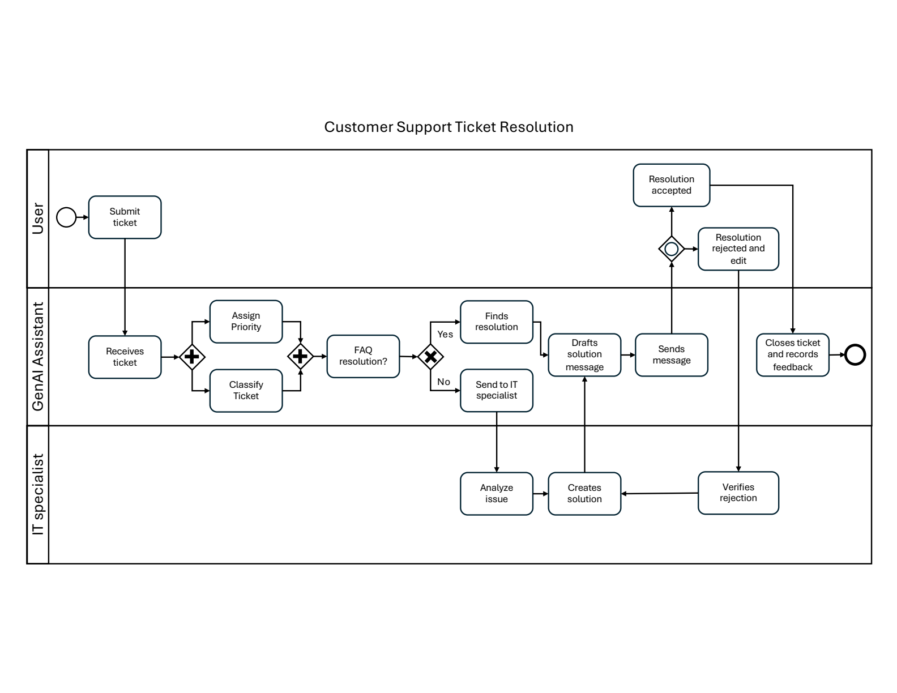
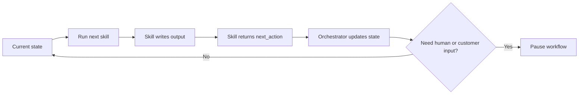

```{python}
#| tags: [parameters]
title = "Building an AI Ticket Workflow"
subtitle = "Skills first, then orchestration and the demo"
author = "Professor Vincent R. Nijs"
program = "Rady MBA / MSBA"
repo = "customer-ticket-process"
```

## `{python} title` {.title-slide}

`{python} subtitle`

`{python} program`

`{python} author`

::: notes
This deck is a tutorial. It starts with the process diagram, teaches students
how to think about skills, then introduces the orchestrator and the web demo.
The intended audience is MBA students who understand business processes but may
not have much technical background.
:::

## What You Will Learn {.content-slide}

By the end, you should be able to explain:

1. How to read the support-ticket workflow diagram
2. What an AI skill is
3. How to turn process steps into skills
4. Why skills need clear inputs and outputs
5. What an orchestrator does
6. How the browser demo lets you inspect the workflow
7. Where human review still matters

::: notes
Frame this as workflow design, not programming. The technical details exist to
make the business process visible and testable.
:::

## The Process We Are Automating {.content-slide}

{fig-alt="Swimlane diagram for customer support ticket resolution" width="100%"}

::: notes
This is the anchor diagram for the whole deck. It has three lanes: User, GenAI
Assistant, and IT specialist. The repo turns this picture into a working demo.
:::

## How to Read the Diagram {.content-slide}

The diagram shows:

- **lanes**: who owns each action
- **boxes**: work to be done
- **diamonds**: decisions or branch points
- **arrows**: handoffs from one step to the next
- **loops**: what happens when the first answer is rejected

The business question:

> Which steps can AI handle, which steps need human review, and how do we keep the handoffs visible?

::: notes
Students should first read this as a business process map. Do not start with
code. Start with roles, work, decisions, and handoffs.
:::

## The Three Lanes {.content-slide}

:::::: columns
::: {.column width="32%"}
**User**

Submits the ticket and later accepts or rejects the answer.
:::

::: {.column width="36%"}
**GenAI Assistant**

Receives, classifies, checks FAQ, drafts, sends, and closes routine work.
:::

::: {.column width="32%"}
**IT Specialist**

Handles cases where the issue needs expert diagnosis or approval.
:::
::::::

::: notes
The workflow is not "AI does everything." It is an AI-assisted process with
clear escalation paths.
:::

## Start with Skills {.section-slide}

## What Is a Skill? {.content-slide}

A skill is a focused unit of work that can be explained, tested, and reused.

Examples from the diagram:

- receive a ticket
- classify a ticket
- assign priority
- check whether an FAQ applies
- draft a customer response
- escalate to a specialist
- verify a rejected answer

::: notes
For MBA students, a skill is like a small standard operating procedure. It does
one job and produces a handoff for the next job.
:::

## Why Not One Big AI Prompt? {.content-slide}

One giant prompt would be hard to manage.

Small skills are better because they are:

- easier to understand
- easier to improve
- easier to test
- easier to audit
- easier to assign to a process owner
- easier to escalate when something goes wrong

::: notes
This is a core management lesson: modularity is governance. It makes process
quality observable.
:::

## Skill Design Canvas {.content-slide}

For each skill, define six things:

- **Trigger:** a new ticket exists
- **Input data:** ticket text, customer tier, affected system
- **Work:** classify and prioritize
- **Output data:** category, priority, rationale
- **Next action:** check FAQ
- **Human review trigger:** low confidence or missing information

::: notes
Students can reuse this canvas for any workflow: admissions, claims, HR,
procurement, loan approval, etc.
:::

## From Diagram Step to Skill {.content-slide}

:::::: columns
::: {.column width="50%"}
**Early workflow**

- Receives ticket -> `receive-ticket`
- Classify Ticket -> `classify-prioritize-ticket`
- Assign Priority -> `classify-prioritize-ticket`
- FAQ resolution? -> `check-faq-resolution`
- Finds resolution -> `draft-faq-response`
:::

::: {.column width="50%"}
**Escalation and feedback**

- Send to IT specialist -> `escalate-to-specialist`
- Analyze issue -> `investigate-specialist-solution`
- Creates solution -> `draft-specialist-response`
- Sends message -> `send-customer-response`
- Verifies rejection -> `verify-feedback-close-or-reopen`
:::
::::::

::: notes
This slide maps the business diagram into the repo structure. Note that
classify and priority are one combined skill in this implementation.
:::

## Example Skill: Classify and Prioritize {.content-slide}

Input:

- ticket subject and description
- affected system
- customer tier
- urgency
- reference categories and priority rules

Output:

- assigned category
- assigned priority
- recommended specialist group
- rationale and confidence
- next action: `check-faq-resolution`

::: notes
This makes a fuzzy process step concrete. The skill does not just "think"; it
produces structured data that the next step can use.
:::

## Example Skill: Check FAQ {.content-slide}

Input:

- ticket details
- triage category
- FAQ knowledge base

Decision:

```text
Strong FAQ match?
  Yes -> draft FAQ response
  No  -> escalate to specialist
```

Output:

- `faq_match_found`
- `faq_id`
- `match_confidence`
- `recommended_next_step`

::: notes
This is the most important branch point in the workflow. It determines whether
the work stays automated or moves to a specialist.
:::

## Example Skill: Escalate to Specialist {.content-slide}

When the FAQ path is not enough, the workflow creates a handoff package.

The handoff includes:

- ticket summary
- category and priority
- business impact
- steps already tried
- why the FAQ did not resolve it
- specialist group
- specific question for the specialist

::: notes
This skill is where automation hands work to a human expert. A good AI workflow
does not hide the reason for escalation.
:::

## Example Skill: Verify Feedback {.content-slide}

After the response is sent, the customer replies.

The feedback skill decides:

- accepted -> close the ticket
- rejected -> reopen and escalate
- ambiguous -> ask for clarification
- rejected twice -> close unresolved with follow-up

::: notes
This is where loops enter the process. Loops need explicit rules or they can
run forever.
:::

## A Skill Must Leave Evidence {.content-slide}

Each skill should leave behind:

- what it read
- what it decided
- why it decided that
- what file or artifact it wrote
- what should happen next

In the demo, this appears in the **Skill input / output** panel.

::: notes
This is the bridge from AI output to auditability. Students should look for
evidence, not just final answers.
:::

## Skill Packages in This Repo {.content-slide}

Each skill folder has two parts:

```text
skills/check-faq-resolution/
  SKILL.md
  scripts/check_faq_resolution.py
```

`SKILL.md`

: Instructions for an LLM agent or human reader

`scripts/*.py`

: Repeatable implementation used by the browser demo

::: notes
This distinction matters. The browser demo runs deterministic scripts from each
skill package. The SKILL.md files document how an AI agent should think about
the skill.
:::

## Then Add Orchestration {.section-slide}

## What Is the Orchestrator? {.content-slide}

The orchestrator is the workflow manager.

It does not classify, draft, or solve tickets.

It does:

- remember which skill is next
- run one skill at a time
- pass the right ticket and run IDs
- read the skill's `next_action`
- pause when customer or human input is needed
- update the web page

::: notes
This is the answer to the earlier confusion: the orchestrator is not a domain
skill. It is the control layer that coordinates the skills.
:::

## Why the Orchestrator Is Code {.content-slide}

The orchestrator is code because control flow must be predictable.

It should be:

- boring
- explicit
- testable
- repeatable
- easy to debug

The skills can contain business logic. The orchestrator should not improvise
the route.

::: notes
Analogy: the orchestrator is like a workflow engine, conductor, or air traffic
controller. The skills are the specialized work teams.
:::

## The Mental Model {.content-slide}

```text
Orchestrator = workflow engine
Skill = focused work unit
Working CSVs = shared case file
JSON envelope = handoff note
Web page = control room dashboard
```

::: notes
Use this vocabulary consistently. It helps students distinguish process design,
execution, data, and user interface.
:::

## How Skills Talk to the Orchestrator {.content-slide}

Each skill returns a structured handoff:

```json
{
  "skill_name": "check-faq-resolution",
  "status": "ok",
  "ticket_id": "WEB-1234ABCD",
  "next_action": "draft-faq-response"
}
```

The orchestrator reads `next_action` and stores the next skill.

::: notes
This is the simplest possible control contract. The skill says what happened
and what should happen next.
:::

## Orchestration Loop {.content-slide}



::: notes
This is the engine behind the step-by-step demo.
:::

## Where the Orchestrator Lives {.content-slide}

In this repo:

```text
scripts/ticket_web_demo.py
```

Key object:

```text
TicketWorkflowOrchestrator
```

What to ask Claude/Codex:

```text
Open scripts/ticket_web_demo.py and explain TicketWorkflowOrchestrator
to me using the workflow diagram.
```

::: notes
Students do not need to read the whole file. They need to know where the
control layer is and what to ask an assistant to explain.
:::

## The Demo {.section-slide}

## Start the Browser Demo {.content-slide}

From the repo folder:

```bash
uv run python scripts/ticket_web_demo.py --host 127.0.0.1 --port 8767
```

Then open:

```text
http://127.0.0.1:8767
```

::: notes
If students are not comfortable with terminal commands, they can ask Claude or
Codex to run the server for them.
:::

## What to Do First {.content-slide}

1. Select an example ticket from the dropdown
2. Click **Start Step Mode**
3. Click **Next** one step at a time
4. Use **Previous** to review earlier states
5. Watch the flow chart, narrative, and skill input/output panel

::: notes
The demo is not only about the final customer response. It is about seeing the
workflow as it runs.
:::

## What to Watch in the UI {.content-slide}

:::::: columns
::: {.column width="50%"}
**Workflow state**

- Flow chart: where we are
- Next skill: what will run next
- Step log: complete skill sequence
:::

::: {.column width="50%"}
**Business evidence**

- Narrative: plain-English story
- Skill input / output: data consumed and produced
- Customer response: what the customer receives
:::
::::::

::: notes
This slide is useful during a live walkthrough. It tells students what to point
their attention to.
:::

## Demo Scenario 1: FAQ Resolution {.content-slide}

Example ticket:

```text
FAQ: customer portal SSO loop
```

Expected path:

```text
receive -> classify/prioritize -> check FAQ
-> draft FAQ response -> send response -> verify feedback -> close
```

Business lesson:

> Good automation handles repeatable work quickly and consistently.

::: notes
Use this as the first demo because it is clean and easy to understand.
:::

## Demo Scenario 2: Human Expert Review {.content-slide}

Example ticket:

```text
Human expert: billing API 502
```

Expected path:

```text
receive -> classify/prioritize -> check FAQ
-> escalate -> specialist investigates -> draft specialist response
-> send response -> verify feedback -> close
```

Business lesson:

> AI can route and summarize expert work, but some answers still need human approval.

::: notes
This is the scenario the user specifically asked for. It also demonstrates how
a new FAQ candidate can be proposed after expert approval.
:::

## Demo Scenario 3: Rejected Answer {.content-slide}

Example ticket:

```text
Reopen: FAQ rejected, then specialist
```

Expected path:

```text
FAQ response sent
-> customer rejects
-> reopen and escalate
-> specialist answer
-> customer accepts
```

Business lesson:

> Feedback loops need rules, ownership, and a stopping condition.

::: notes
This scenario makes the loop on the right side of the diagram concrete.
:::

## Demo Scenario 4: Ambiguous Feedback {.content-slide}

Example ticket:

```text
Feedback: ambiguous customer reply
```

Expected outcome:

```text
request_clarification
```

Business lesson:

> When the signal is unclear, the right workflow action may be to pause.

::: notes
This is a governance point. Not every uncertain input should be forced into an
automated decision.
:::

## Run the Scenario Suite {.content-slide}

The repo includes 20 curated examples.

Run them all:

```bash
uv run python skills/summarize-workflow-suite/scripts/summarize_workflow_suite.py
```

Open the HTML report:

```text
/tmp/customer-ticket-process-suite-report.html
```

::: notes
Explain this as quality control. A workflow should be tested against many
scenarios, not just one successful demo.
:::

## Build Your Own Workflow {.section-slide}

## Step 1: Draw the Process {.content-slide}

Start the way this deck started:

- who are the lanes?
- what work happens in each lane?
- where are the decisions?
- where are the handoffs?
- where can work loop back?
- where must a human review?

::: notes
Students should not start by coding. They should start with the workflow map.
:::

## Step 2: Identify Candidate Skills {.content-slide}

Look for process boxes that:

- have a clear trigger
- use identifiable data
- produce a useful handoff
- can be evaluated
- are repeated often enough to matter

Avoid skills that are too broad, such as:

```text
Resolve the whole ticket
```

::: notes
This is a practical heuristic for skill design.
:::

## Step 3: Define Skill Contracts {.content-slide}

For each skill, write:

```text
Skill name:
Input data:
Output data:
Decision rules:
Next action:
Human review trigger:
Artifact written:
```

This is the minimum contract for a useful AI workflow step.

::: notes
This mirrors what the repo implements with working CSVs and JSON envelopes.
:::

## Step 4: Define Branches and Stops {.content-slide}

Every workflow needs rules for:

- success path
- exception path
- escalation path
- customer or human feedback
- ambiguous input
- repeated failure
- final close

::: notes
This is where management policy enters the system. A technical team should not
invent these policies alone.
:::

## Step 5: Create Test Scenarios {.content-slide}

Do not test only the happy path.

Create examples for:

- common routine case
- high-priority case
- no-match case
- expert-review case
- rejected answer
- ambiguous answer
- repeated failure

In this repo, examples live in:

```text
scripts/ticket_scenarios.py
```

::: notes
This reinforces the idea of an operational test portfolio.
:::

## Step 6: Add a Demo Interface {.content-slide}

A good workflow demo should show:

- current state
- completed steps
- branch decisions
- data into and out of each skill
- final output
- where human judgment is required

::: notes
The web app is not just decoration. It is a teaching and debugging interface.
:::

## What to Ask Claude or Codex {.content-slide}

Useful prompts:

```text
Explain this repo using slides/ticket-workflow-orchestration.qmd.
```

```text
Walk me through the Human expert: billing API 502 scenario.
For each step, name the skill, input, output, and next action.
```

```text
Help me design a similar workflow for [loan approval / HR onboarding / claims].
Use the skill design canvas from the deck.
```

::: notes
This makes the deck usable as an LLM reference artifact.
:::

## Final Takeaway {.content-slide}

The demo is not just "AI answers support tickets."

It shows how to design an AI workflow:

- map the process
- split work into skills
- define data handoffs
- orchestrate the steps
- make decisions visible
- preserve human review
- test realistic scenarios

::: notes
End on the management lesson: AI workflow design is process architecture plus
governance, not only model selection.
:::
