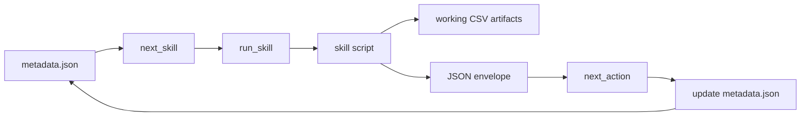
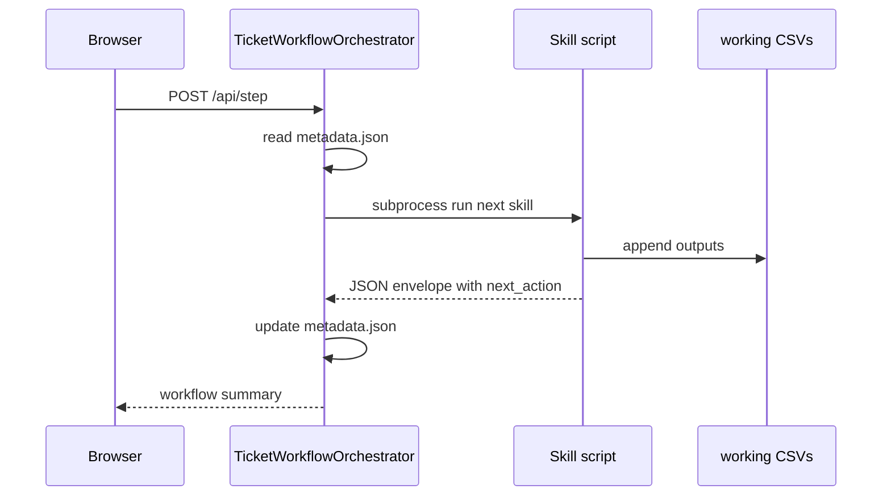

```{python}
#| tags: [parameters]
title = "AI Ticket Workflow: Skills and Orchestration"
author = "Professor Vincent R. Nijs"
program = "Rady MSBA"
repo = "customer-ticket-process"
```

## `{python} title` {.title-slide}

`{python} program`

`{python} author`

::: notes
The purpose of this short deck is to remove ambiguity about one specific point:
what is the orchestrator, what is a skill, and how does a skill actually start?
:::

## The short answer {.content-slide}

* **The orchestrator is not `audit-ticket-process`**
* **The orchestrator is** `scripts/ticket_web_demo.py`
* Specifically: `TicketWorkflowOrchestrator`
* `audit-ticket-process` is a diagnostic skill
* The web app does **not** load `SKILL.md` with an LLM

::: notes
The main misconception to address: `audit-ticket-process` sounds like it might
be the orchestrator because it can inspect state and recommend a next action.
It is not the web-demo orchestrator. It is one skill package among the skill
packages. Also be explicit that the browser demo is not using an LLM skill
loader.
:::

## Three different things {.content-slide}

:::::: columns
::: {.column width="32%"}
**Orchestrator**

`scripts/ticket_web_demo.py`

Runs the workflow.
:::

::: {.column width="34%"}
**Skill instructions**

`skills/<skill>/SKILL.md`

Tells an AI agent when/how to use a skill.
:::

::: {.column width="34%"}
**Skill implementation**

`skills/<skill>/scripts/*.py`

Executable code used by the web demo.
:::
::::::

::: notes
In this repo, a skill folder is really a small package. The SKILL.md file is
loaded by an LLM agent such as Codex or Claude when the agent is using skills.
The web demo is not that kind of runtime. It directly executes the Python file
inside the same folder.
:::

## Where is THE orchestrator? {.content-slide}

```text
scripts/ticket_web_demo.py
```

Key locations:

* `main()` starts the web server
* `do_POST()` receives browser actions
* `TicketWorkflowOrchestrator` owns workflow state
* `run_skill()` starts one skill script
* `metadata.json` stores the next skill

::: notes
If students ask "show me the orchestrator," open `scripts/ticket_web_demo.py`
and search for `class TicketWorkflowOrchestrator`.
:::

## How the web demo starts {.content-slide}

```bash
uv run python scripts/ticket_web_demo.py \
  --host 127.0.0.1 \
  --port 8767
```

This starts a local HTTP server.

```text
main()
  -> make_handler()
  -> ThreadingHTTPServer(...)
  -> server.serve_forever()
```

::: notes
The orchestrator is not automatically running in the background. It starts when
the web demo server starts.
:::

## What happens when a ticket is submitted? {.content-slide}

```text
Browser button
  -> POST /api/tickets/start
  -> start_submission()
  -> TicketWorkflowOrchestrator.start_ticket()
  -> create_web_ticket()
  -> metadata.json says next_skill = receive-ticket
```

Nothing has run yet.

The first skill runs only when the user clicks **Next**.

::: notes
This is important for debugger mode. Starting step mode creates a run and shows
the first current node, but it intentionally stops before the first skill.
:::

## What happens when Next is clicked? {.content-slide}

```text
Browser Next button
  -> POST /api/step
  -> process_step()
  -> TicketWorkflowOrchestrator.step()
  -> read metadata.json
  -> next_skill = receive-ticket
  -> run_skill("receive-ticket", ...)
```

`run_skill()` starts the **skill's Python script** as a subprocess.

::: notes
This is the exact mechanism. The orchestrator reads persisted state, decides
which skill is next, and runs that skill.
:::

## How a workflow step is started {.content-slide}

The orchestrator has a mapping:

```python
SKILL_SCRIPTS = {
    "receive-ticket": "skills/receive-ticket/scripts/receive_ticket.py",
    "classify-prioritize-ticket": ".../classify_prioritize_ticket.py",
    "check-faq-resolution": ".../check_faq_resolution.py",
}
```

Then it builds a command line and runs the mapped Python file.

::: notes
This is why the repo appears to have scripts calling scripts. That is by
design for the web demo. It is not the same thing as an LLM loading SKILL.md.
:::

## Example command created by the orchestrator {.content-slide}

```bash
python skills/receive-ticket/scripts/receive_ticket.py \
  --ticket-id WEB-1234ABCD \
  --data-dir /tmp/customer-ticket-process-web-demo/wf-web-1234abcd/data \
  --out-dir /tmp/customer-ticket-process-web-demo/wf-web-1234abcd/working \
  --workflow-run-id wf-web-1234abcd \
  --step-id receive-ticket-01-a1b2c3 \
  --json
```

The `--json` response is the handoff back to the orchestrator.

::: notes
The CLI contract is the key teaching object. Every skill accepts the same core
workflow arguments and emits a JSON envelope.
:::

## What does a skill return? {.content-slide}

Each skill returns a JSON envelope:

```json
{
  "skill_name": "receive-ticket",
  "status": "ok",
  "ticket_id": "WEB-1234ABCD",
  "workflow_run_id": "wf-web-1234abcd",
  "step_id": "receive-ticket-01-a1b2c3",
  "next_action": "classify-prioritize-ticket"
}
```

The orchestrator reads `next_action`.

::: notes
The orchestrator does not decide that triage is next by using a prompt. It reads
the deterministic envelope returned by the skill.
:::

## The routing loop {.content-slide}



::: notes
This loop is the engine. The skill writes data and returns next_action; the
orchestrator stores that next action as next_skill for the next click.
:::

## Is this a "regular skill" invocation? {.content-slide}

No.

The web demo uses the **executable script inside each skill folder**:

```text
skills/receive-ticket/
  SKILL.md                  loaded by an LLM agent
  scripts/receive_ticket.py run by the web orchestrator
```

So in the web demo, `SKILL.md` is a contract and teaching artifact.

::: notes
This is the honest answer. The browser demo is not an LLM agent. It does not
have a skill loader. It uses the same folder layout, but it directly executes
the script file.
:::

## Then what is a skill in this repo? {.content-slide}

For an LLM agent:

```text
SKILL.md is active instructions
```

For the browser demo:

```text
SKILL.md is not loaded
scripts/*.py is executed
```

That means the repo uses **skill packages**, but the web demo uses their
deterministic executable entry points.

::: notes
If this distinction feels uncomfortable, that is useful. It means we should not
claim the web app is invoking skills in exactly the same way Codex or Claude
would.
:::

## What is `audit-ticket-process`? {.content-slide}

`audit-ticket-process` is a skill.

It answers:

* What has happened on this ticket?
* What state is the ticket in?
* What is the next valid action?

It does **not** run the whole web workflow.

::: notes
This is a useful skill, but it is not the web-demo orchestrator. It is closer to
a state inspector or diagnostic tool.
:::

## Why have an audit skill at all? {.content-slide}

Because diagnostics are useful.

`audit-ticket-process` can be run at any point:

```bash
uv run python skills/audit-ticket-process/scripts/audit_ticket_process.py \
  --ticket-id TKT-00042
```

It reports state, timeline, and recommended next action.

::: notes
The audit skill can help a person or an agent understand where a ticket is. But
the web demo uses `metadata.json` plus the orchestrator's own routing state.
:::

## The real web-demo flow {.content-slide}



::: notes
This is a good slide to show when students ask "where is the AI workflow?" The
workflow is the combination of orchestrator control flow plus skill scripts.
:::

## Why scripts instead of prompt-only skills? {.content-slide}

For this class demo, deterministic scripts give us:

* repeatable results
* unit tests
* visible input/output data
* debugger-style stepping
* a regression suite over 20 tickets

Prompt-only skills are useful for instructions.
Script-backed skills are useful for reliable workflow execution.

::: notes
This is not anti-AI. It is the right separation: AI can help create, explain,
and operate the skills, but the teaching demo needs reproducible behavior.
:::

## The clean mental model {.section-slide}

## Mental model {.content-slide}

```text
Orchestrator = workflow engine
Skill script = worker
SKILL.md = instruction manual loaded by an AI agent
working CSVs = shared state and artifacts
JSON envelope = handoff between worker and engine
```

::: notes
This is the vocabulary I would keep using consistently in class.
:::

## How to demo this live {.content-slide}

1. Start the server
2. Open `http://127.0.0.1:8767`
3. Pick an example ticket
4. Click **Start Step Mode**
5. Click **Next**
6. Point to:
   * current flow node
   * narrative
   * skill input/output
   * next skill

::: notes
Students should see that each click runs one skill and updates the artifacts.
:::

## One command to show the suite {.content-slide}

```bash
uv run python skills/summarize-workflow-suite/scripts/summarize_workflow_suite.py
```

This runs 20 curated scenarios and writes:

```text
/tmp/customer-ticket-process-suite-report.html
```

::: notes
This is useful to show that the workflow is not only a one-off demo. The same
orchestrator can run a scenario suite and summarize what happened.
:::

## Final distinction {.content-slide}

* `scripts/ticket_web_demo.py`
  * **the orchestrator**
  * starts skills
  * owns step mode

* `skills/audit-ticket-process/`
  * **a diagnostic skill**
  * inspects state
  * recommends a next action

* `skills/<skill>/scripts/*.py`
  * **executable code inside each skill package**
  * do the work
  * return `next_action`

::: notes
This is the slide to end on if the goal is to clear up the confusion.
:::
